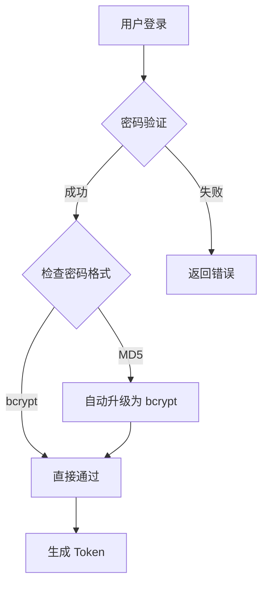

# 🔐 认证系统统一改造 - 迁移文档

> **分支**: `feature/unified-auth-system`  
> **日期**: 2025-10-06  
> **目标**: 将 SaaS 后端（creamoda_be_new）和 Agent 后端（agent-mvp-be）的登录系统统一

---

## 📋 改造概览

### 核心变更

1. ✅ **密码加密升级**: MD5+salt → bcrypt
2. ✅ **渐进式迁移**: 用户登录时自动升级旧密码
3. ✅ **Google OAuth 增强**: 添加 Redis 会话存储
4. ✅ **向后兼容**: 完全支持现有用户无缝登录

---

## 🔄 已修改的文件

### 1. `src/utils/password.py` (核心改造)

**新增功能：**
- `hash_password(password: str)` - 使用 bcrypt 加密密码
- `verify_password()` - 双模式验证（bcrypt 优先，MD5 兼容）
- `should_upgrade_password()` - 检查是否需要升级
- `upgrade_user_password()` - 自动升级 MD5 密码为 bcrypt

**废弃但保留：**
- `generate_salt()` - 仅用于向后兼容
- `hash_password_md5()` - 仅用于验证旧密码

**关键逻辑：**
```python
# 验证策略
1. 优先尝试 bcrypt 验证 (以 $2b$ 开头)
2. 如果不是 bcrypt 且提供了 salt，则尝试 MD5 验证
3. 其他情况返回 False
```

---

### 2. `src/api/v1/user.py`

**注册接口改造 (`/api/v1/user/register`):**
```python
# 变更前
salt = generate_salt()
hashed_password = hash_password(request.pwd, salt)

# 变更后
hashed_password = hash_password(request.pwd)  # bcrypt
salt = None  # bcrypt 自动管理 salt
```

**登录接口改造 (`/api/v1/user/login`):**
```python
# 新增自动升级逻辑
if should_upgrade_password(user.pwd):
    logger.info(f"检测到用户 {user.email} 使用旧的 MD5 密码，正在自动升级为 bcrypt")
    upgrade_user_password(db, user, request.pwd)
```

---

### 3. `src/api/v1/auth.py`

**Google OAuth 回调改造:**

添加 Redis 会话存储（两个 endpoint）:
- `/api/v1/auth/callback` (标准 OAuth)
- `/api/v1/auth/google-callback` (Google One Tap)

```python
# 新增逻辑
redis_client.setex(
    f"user_session:{email}",
    settings.security.access_token_expire_minutes * 60,
    access_token
)
```

---

## 🔍 技术细节

### 密码格式对比

| 类型 | 格式示例 | salt 字段 | 安全性 |
|------|---------|----------|--------|
| **旧 (MD5)** | `5f4dcc3b5aa765d61d8327deb882cf99` | 16字符随机字符串 | ❌ 弱 |
| **新 (bcrypt)** | `$2b$12$N9qo8uLOickgx2ZMRZoMye...` | 自动内置 | ✅ 强 |

### 渐进式迁移流程



### 数据库字段变化

**UserInfo 表：**
- `pwd`: 字段保留，内容从 MD5 哈希变为 bcrypt 哈希
- `salt`: 新用户为 NULL，旧用户保留用于兼容验证

---

## ✅ 兼容性保证

### 场景 1: 旧用户首次登录（MD5 密码）

```python
# 数据库状态
pwd = "5f4dcc3b5aa765d61d8327deb882cf99"  # MD5
salt = "abc123xyz456"  # 16字符

# 登录流程
1. verify_password() 检测到不是 bcrypt 格式
2. 使用 MD5+salt 验证 ✅
3. 验证成功后自动调用 upgrade_user_password()
4. 更新数据库：
   pwd = "$2b$12$..."  # bcrypt
   salt = NULL
```

### 场景 2: 新用户注册

```python
# 注册时直接使用 bcrypt
pwd = "$2b$12$N9qo8uLOickgx2ZMRZoMye..."
salt = NULL
```

### 场景 3: Google 登录用户（无密码）

```python
# Google 用户不受影响
pwd = NULL
salt = NULL
email_verified = 1
google_sub_id = "..."
```

---

## 🧪 测试清单

### 单元测试

```bash
# TODO: 添加以下测试用例
pytest tests/test_password.py::test_bcrypt_hash
pytest tests/test_password.py::test_md5_verification_and_upgrade
pytest tests/test_password.py::test_verify_password_dual_mode
```

### 集成测试

| 测试场景 | 预期结果 | 状态 |
|---------|---------|------|
| 1. 新用户注册（bcrypt） | ✅ 成功，pwd 以 $2b$ 开头 | ⏳ 待测试 |
| 2. 旧用户登录（MD5） | ✅ 成功登录 + 自动升级 | ⏳ 待测试 |
| 3. 升级后再次登录 | ✅ 使用 bcrypt 验证 | ⏳ 待测试 |
| 4. Google 登录 | ✅ 正常登录 + Redis 会话 | ⏳ 待测试 |
| 5. 错误密码尝试 | ❌ 验证失败 | ⏳ 待测试 |

---

## 🚀 部署步骤

### 1. 备份数据库（必须！）

```bash
# 备份 user_info 表
mysqldump -u root -p creamoda user_info > user_info_backup_$(date +%Y%m%d).sql
```

### 2. 部署代码

```bash
# 切换到新分支
git checkout feature/unified-auth-system

# 安装依赖（bcrypt 已在 pyproject.toml 中）
pdm install

# 重启服务
systemctl restart creamoda-backend
```

### 3. 验证部署

```bash
# 检查日志
tail -f logs/app.log | grep "bcrypt\|upgrade"

# 测试健康检查
curl http://localhost:8000/health
```

### 4. 监控迁移进度

```sql
-- 查看已升级用户数量
SELECT 
    COUNT(*) as total_users,
    SUM(CASE WHEN pwd LIKE '$2b$%' THEN 1 ELSE 0 END) as bcrypt_users,
    SUM(CASE WHEN pwd NOT LIKE '$2b$%' AND pwd IS NOT NULL THEN 1 ELSE 0 END) as md5_users,
    SUM(CASE WHEN pwd IS NULL THEN 1 ELSE 0 END) as google_users
FROM user_info;
```

---

## ⚠️ 风险评估

### 低风险 ✅

- ✅ 完全向后兼容，旧用户可以正常登录
- ✅ 自动升级不影响用户体验（后台透明执行）
- ✅ 失败回滚简单（恢复数据库备份）

### 需要注意 ⚡

- ⚡ 首次部署后观察 24 小时，确保没有异常
- ⚡ 监控错误日志中是否有 "密码验证失败" 的异常增长
- ⚡ bcrypt 比 MD5 慢，但对登录性能影响可忽略（<100ms）

---

## 📊 预期效果

### 性能影响

| 操作 | 旧系统 (MD5) | 新系统 (bcrypt) | 差异 |
|------|------------|----------------|------|
| 注册 | ~5ms | ~50ms | +45ms (可接受) |
| 登录（bcrypt用户） | ~5ms | ~50ms | +45ms |
| 登录（MD5用户首次） | ~5ms | ~55ms | +50ms (仅一次) |

### 安全提升

- 🔒 抗彩虹表攻击：MD5 ❌ → bcrypt ✅
- 🔒 抗暴力破解：MD5 (极弱) → bcrypt (强)
- 🔒 抗时序攻击：bcrypt 自动防护

---

## 🔄 回滚方案

如果出现重大问题，可以快速回滚：

```bash
# 1. 恢复代码
git checkout main

# 2. 恢复数据库
mysql -u root -p creamoda < user_info_backup_YYYYMMDD.sql

# 3. 重启服务
systemctl restart creamoda-backend
```

---

## 📝 后续计划

### 短期（1-2周）

- [ ] 编写单元测试和集成测试
- [ ] 创建管理命令批量升级未登录用户密码
- [ ] 监控迁移进度仪表盘

### 中期（1个月）

- [ ] 所有用户完成迁移后，移除 MD5 相关代码
- [ ] 数据库字段优化（考虑移除 salt 字段）

### 长期

- [ ] 考虑添加 2FA 双因素认证
- [ ] 密码强度策略优化

---

## 👥 联系人

- **开发负责人**: [你的名字]
- **代码审查**: [审查人]
- **紧急联系**: [联系方式]

---

## 📚 参考文档

- [bcrypt 官方文档](https://pypi.org/project/bcrypt/)
- [OWASP 密码存储指南](https://cheatsheetseries.owasp.org/cheatsheets/Password_Storage_Cheat_Sheet.html)
- [Agent 后端代码参考](../agent-mvp-be/src/utils/password.py)

---

**最后更新**: 2025-10-06  
**文档版本**: v1.0

